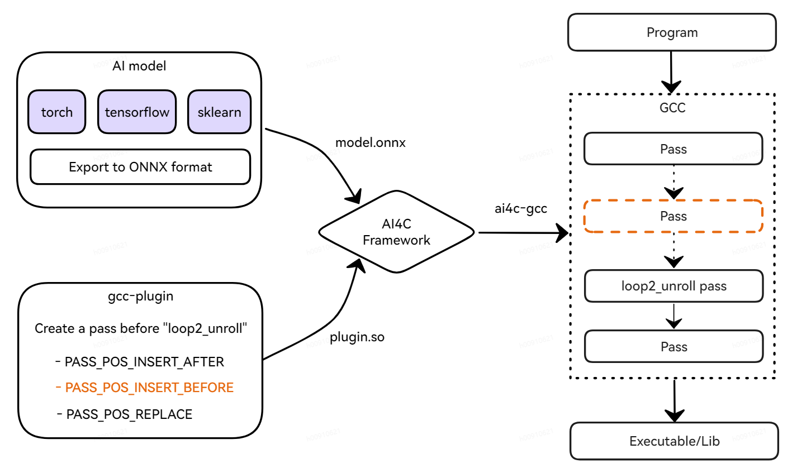

## GCC AI-Enabled-Optimization

This is the AI-enabled compilation optimization module, which consists of three parts:
- ONNX model, which is the optimized model after training.
- An gcc-plugin, to run ONNX model inference and obtains optimization parameters.
- AI4Compiler framework, to provide ONNX inference engine and GCC optimized compilation command.



#### GCC compilation via AI4Compiler

Using `ai4c-gcc` or `ai4c-g++` command to run the optimized compilation.

```sh
ai4c-gcc main.c -o main \
  --add-opt-plugin=rtl_unroll_opt_plugin_gcc12.so \
  --add-opt-model=unroll_opt.onnx
```

If you want to use a non-system gcc version, set env with 
`export AI4C_C_COMPILER=/path/to/gcc` and `export AI4C_C_COMPILER=/path/to/g++`

Using `--add-opt-plugin` and `--add-opt-model` to insert a gcc-plugin and an ONNX
model respectively. Multiple groups of plugin and model can be entered, but the 
number of it must be the same.

### Call AI4C Inference Engine in GCC Plugin (C++)

Using `ai4c-gcc --inference-engine` to get the path of inference engine library.

- Use `dlopen` to dynamically load ai4c_onnxrunner.so
```c++
void *handle = dlopen("/path/to/ai4c_onnxrunner.so", RTLD_LAZY);
if (!handle) {
    fprintf(stderr, "%s\n", dlerror());
}
```

- Use `dlsym` to load available functions
```c++
typedef void (*init_engine_t)(const char*);
init_engine_t initialize = (init_engine_t) dlsym (
    handle, "initialize");
```

Interfaces of inference engine:
- [x] `initialize` is used to initialize inference engine (required).
- [x] `add_int64_input` is used to add `int64_t*` type input.
- [x] `add_int32_inpu` is used to add `int32_t*` type input.
- [x] `add_float_input` is used to add `float*` type input.
- [x] `add_string_input` is used to add `char**` type input.
- [x] `inference` is used to run model inference.
- [x] `get_int32_output` is used to get `int32_t*` model output.
- [x] `get_int64_output` is used to get `int64_t*` model output.
- [x] `get_float_output` is used to get `float*` model output.
- [x] `free_engine` is used to free memory allocation of inference engine.

- initialize inference engine
```c++
initialize("model.onnx");
```

- add input features
```c++
int64_t in1[5] = {1, 2, 3, 4, 5};
add_int64_input(in1, 10);

float in2[5] = {1.0f, 2.0f, 3.0f, 4.0f, 5.0f};
add_float_input(in2, 5);
```

- run model inference
```c++
inference();
```

- get inference result
```c++
float* result = get_float_output(0);
```

#### Full Demo (gcc-plugin)

This is a complete code to use ai4c inference engine in a gcc-plugin.

- `block_correction_plugin.cpp`

```c++
#include <dlfcn.h>
#include <unistd.h>

#include <cstdint>
#include <random>
#include <string>

#include "gcc-plugin.h"
#include "plugin-version.h"
#include "cfgloop.h"
#include "context.h"
#include "tree-pass.h"

int plugin_is_GPL_compatible;

char* g_model_path;
char* g_infer_path;

/* Interfaces of AI4C Inference Engine */
void* g_infer_handle;

typedef void (*init_engine_t)(const char*);
init_engine_t initialize;

typedef void (*add_int64_input_t)(int64_t*, int);
add_int64_input_t add_int64_input;

typedef void (*add_int32_input_t)(int32_t*, int);
add_int32_input_t add_int32_input;

typedef void (*add_float_input_t)(float*, int);
add_float_input_t add_float_input;

typedef void (*add_double_input_t)(double*, int);
add_double_input_t add_double_input;

typedef void (*add_string_input_t)(const char**, int);
add_string_input_t add_string_input;

typedef int (*inference_t)();
inference_t inference;

typedef int32_t* (*get_int32_output_t)(int);
get_int32_output_t get_int32_output;

typedef int64_t* (*get_int64_output_t)(int);
get_int64_output_t get_int64_output;

typedef float* (*get_float_output_t)(int);
get_float_output_t get_float_output;

typedef void (*free_engine_t)();
free_engine_t free_engine;

const pass_data block_correction_pass_data = {
    .type = RTL_PASS,  // GIMPLE_PASS, SIMPLE_IPA_PASS, IPA_PASS
    .name = "block_correction_pass",
    .optinfo_flags = OPTGROUP_NONE,
    .tv_id = TV_NONE,
    .properties_required = 0,
    .properties_provided = 0,
    .properties_destroyed = 0,
    .todo_flags_start = 0,
    .todo_flags_finish = 0};

struct block_correction_pass : rtl_opt_pass {
 public:
  block_correction_pass() : rtl_opt_pass(block_correction_pass_data, g) {}

  virtual unsigned int execute(function* fun) override {
    initialize(g_model_path);

    // Get input feature {in1} via `function* fun`
    int64_t in1[99];
    std::random_device rd;
    std::mt19937 gen(rd());
    std::uniform_int_distribution<int64_t> dist;
    for (int i = 0; i < 99; i++) {
      in1[i] = dist(gen);
    }
    add_int64_input(in1, 99);

    int err = inference();
    if (err) return err;

    int64_t* result = get_int64_output(0);

    // Use result to optimize fun params
    printf("Result --> [%ld, %ld, %ld]\n", result[0], result[1], result[2]);

    // Release the inference engine via `fress_engine()`
    // when the model inference occupies too much memory.
    // free_engine();
    return 0;
  }

  virtual block_correction_pass* clone() override { return this; }
};

struct register_pass_info block_correction_passinfo {
  // create `block_correction_pass` before `loop2_unroll`
  .pass = new block_correction_pass(), .reference_pass_name = "loop2_unroll",
  .ref_pass_instance_number = 0,
  .pos_op = PASS_POS_INSERT_BEFORE  // PASS_POS_INSERT_AFTER, PASS_POS_REPLACE
};

int plugin_init(struct plugin_name_args* plugin_info,
                struct plugin_gcc_version* version) {
  if (!plugin_default_version_check(version, &gcc_version)) {
    printf("incompatible gcc/plugin versions\n");
    return 1;
  }

  for (int i = 0; i < plugin_info->argc; i++) {
    std::string key(plugin_info->argv[i].key);
    std::string value(plugin_info->argv[i].value);
    if (std::strcmp(plugin_info->argv[i].key, "model") == 0) {
      g_model_path = plugin_info->argv[i].value;
    } else if (std::strcmp(plugin_info->argv[i].key, "engine") == 0) {
      g_infer_path = plugin_info->argv[i].value;
    }
  }

  if (access(g_model_path, F_OK)) {
    fprintf(stderr, "Model '%s' not found\n", g_model_path);
    return -1;
  }

  g_infer_handle = dlopen(g_infer_path, RTLD_LAZY);
  if (!g_infer_handle) {
    fprintf(stderr, "%s\n", dlerror());
    return -1;
  }

  initialize = (init_engine_t)dlsym(g_infer_handle, "initialize");
  add_int64_input = (add_int64_input_t)dlsym(g_infer_handle, "add_int64_input");
  add_double_input =
      (add_double_input_t)dlsym(g_infer_handle, "add_double_input");
  inference = (inference_t)dlsym(g_infer_handle, "inference");
  get_int64_output =
      (get_int64_output_t)dlsym(g_infer_handle, "get_int64_output");
  free_engine = (free_engine_t)dlsym(g_infer_handle, "free_engine");

  dlclose(g_infer_handle);

  const char* const plugin_name = plugin_info->base_name;
  register_callback(plugin_name, PLUGIN_PASS_MANAGER_SETUP, NULL,
                    &block_correction_passinfo);
  return 0;
}

```

- `run_block_correction.sh`

```sh
#!/bin/bash
gxx_compiler=g++
gcc_compiler=gcc

plugin_include_path=$(gcc -print-file-name=plugin)
infer_engine_path=$(ai4c-gcc --inference-engine)

model_path=../../../../models/block_correction_model.onnx

$gxx_compiler -std=c++17 -Wall -fno-rtti  \
	-I$plugin_include_path/include        \
	-fPIC -c -o block_correction_plugin.o \
	block_correction_plugin.cpp

$gxx_compiler -static-libstdc++ -shared \
    -o block_correction_plugin.so -lonnxruntime      \
    block_correction_plugin.o

$gcc_compiler test.c -O2 -o test -funroll-loops                    \
    -fplugin=block_correction_plugin.so                            \
    -fplugin-arg-block_correction_plugin-model=$model_path         \
    -fplugin-arg-block_correction_plugin-engine=$infer_engine_path

if [ $# -eq 0  ]; then
    exit 0
fi

if [ "$1" = "clean" ]; then
    rm -f block_correction_plugin.o
    rm -f block_correction_plugin.so
    rm -f test
fi
```